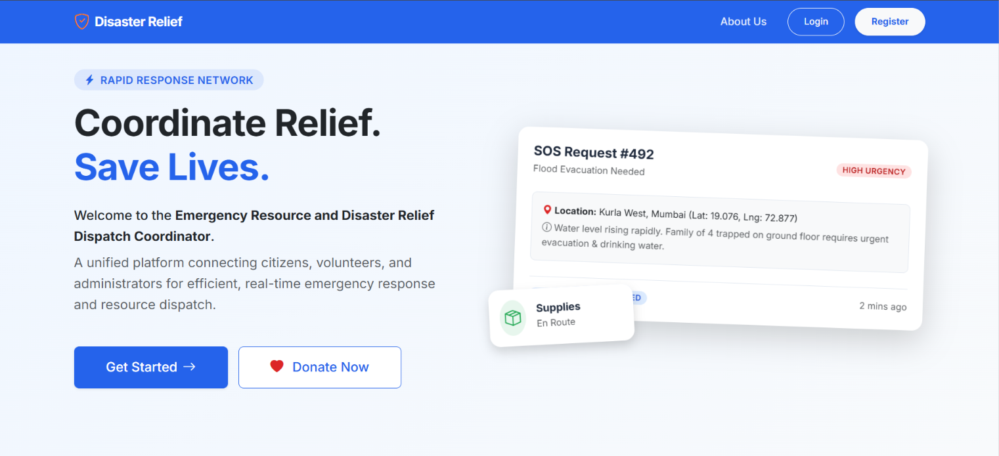
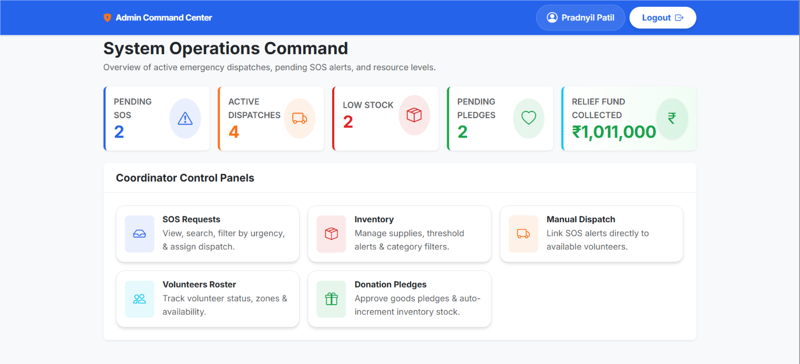
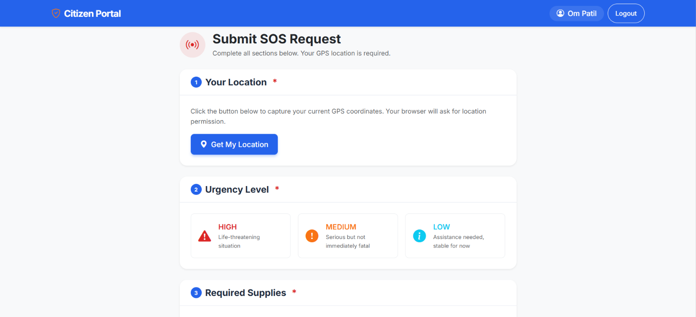
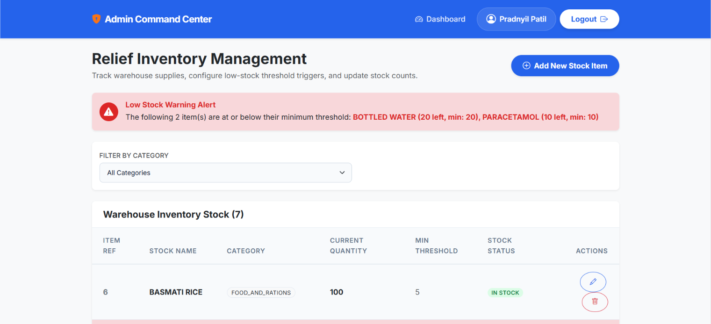
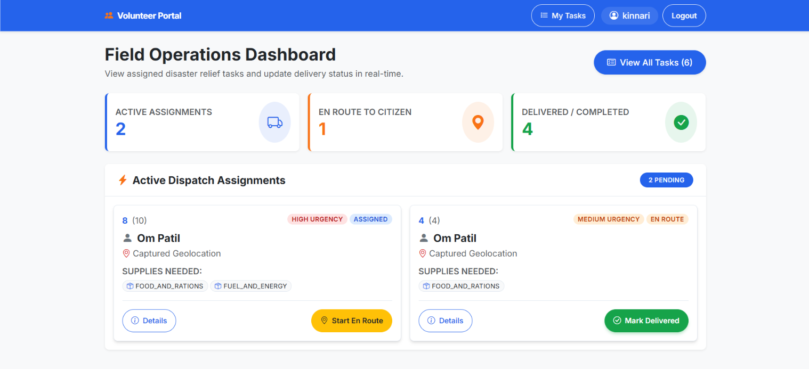
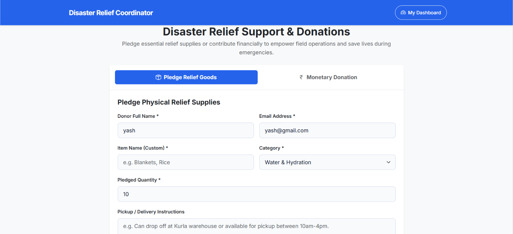

<div align="center">
  
  # 🚨 Emergency Resource & Disaster Relief Dispatch Coordinator
  
  **An intelligent, full-stack disaster management system designed to coordinate citizen rescues, dispatch volunteers, manage warehouse inventory, and process donor pledges.**

  [](#)
  [](#)
  [](#)
  [](#)

</div>

---

## 📖 Overview

When disaster strikes, communication and resource allocation are the difference between life and death. The **Emergency Resource & Disaster Relief Dispatch Coordinator** is a centralized command platform that bridges the gap between stranded citizens, field volunteers, generous donors, and administrative dispatchers. 

Built with a robust **Java Spring Boot backend** and a dynamic **React frontend**, this system automates dispatch logistics, tracks inventory in real-time, and ensures help gets to where it is needed most.

---

## ✨ Key Features

- **🚨 Citizen SOS & Offline SMS:** 
  Citizens can submit geolocation-based SOS requests via the web portal. For offline users, we have built a proof-of-concept SMS Webhook gateway that allows the backend to intake emergency text messages (currently simulated via Postman) directly into the database.
- **🎛️ Admin Command Center:** 
  A unified dashboard allowing dispatchers to view all pending SOS requests, assign available volunteers, and allocate specific physical relief supplies to each rescue mission.
- **📦 Smart Warehouse & Inventory:** 
  Real-time CRUD management of all physical relief items. Stock is automatically deducted when allocated to a volunteer and triggers low-stock alerts when thresholds are breached.
- **❤️ Donor Ecosystem:** 
  Donors can securely pledge physical relief goods (which auto-restocks the inventory upon Admin approval) or make simulated financial contributions using a mock Razorpay integration.
- **🧑‍🚒 Volunteer Field Portal:** 
  A mobile-friendly interface for field workers to manage their assigned tasks, view the exact inventory stock they need to carry, and update their mission status (`EN ROUTE`, `DELIVERED`, etc.) in real-time.

---

## 🏗️ Tech Stack

| Component | Technology | Description |
| :--- | :--- | :--- |
| **Frontend** | React.js, Vite, Bootstrap 5 | Dynamic SPA with Context API for state management. |
| **Backend** | Java 21, Spring Boot | REST API architecture with Spring Security (JWT). |
| **Database** | MySQL 8.0, Spring Data JPA | Relational database with strict entity mapping. |
| **Infrastructure** | Docker, Docker Compose | Containerized environments for seamless deployment. |

---

## 📸 Previews

<details>
<summary>Click to view screenshots</summary>

- **Landing Page:** 
- **Admin Command Center:** 
- **Citizen SOS Form:** 
- **Warehouse Inventory:** 
- **Volunteer Task App:** 
- **Donor Portal:** 

</details>

---

## 🚀 Getting Started

### Prerequisites
- [Docker](https://docs.docker.com/get-docker/) & Docker Compose installed.

### One-Click Installation
The fastest way to run the entire system (Frontend, Backend, and Database) is using Docker Compose.

1. **Clone the repository:**
   ```bash
   git clone https://github.com/Pradnyil31/disaster-relief-dispatch.git
   cd disaster-relief-dispatch
   ```

2. **Boot up the containers:**
   ```bash
   docker compose up --build
   ```

3. **Access the Application:**
   - **Frontend:** `http://localhost:80`
   - **Backend API:** `http://localhost:8080/api/v1`

---

## ⚙️ Environment Configuration
If you wish to run the Spring Boot server manually, you will need to configure the following environment variables in your `application.properties` or system environment:

```env
SPRING_DATASOURCE_URL=jdbc:mysql://localhost:3306/disaster_relief_db
SPRING_DATASOURCE_USERNAME=root
SPRING_DATASOURCE_PASSWORD=yourpassword
JWT_SECRET=YourSuperSecretKeyMustBeVeryLong32Bytes
```

---

## 📡 API & Postman Integration

The backend exposes a fully documented REST API. 

**Simulating the Offline SMS Gateway (Twilio):**
You can simulate a citizen sending a text message for help by sending a POST request via Postman:
- **URL:** `POST http://localhost:8080/api/v1/sos/webhook/sms`
- **Body (`x-www-form-urlencoded`):**
  - `From`: `+919876543210`
  - `Body`: `Help, flooded house at Linking Road.`

---

## 🤝 Contributing
Contributions, issues, and feature requests are welcome! Feel free to check the [issues page](#) if you want to contribute.

## 📝 License
This project is [MIT](https://choosealicense.com/licenses/mit/) licensed.
